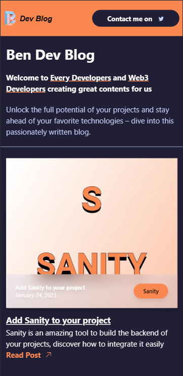

# **BENDEV <span style="color: #F9874F;">BLOG</span>**

<div style="margin-top: 25px;"></div>

### **Tools and Technologies Used**

<div style="margin-top: 15px;" />

- 

<div style="padding-top: 5px;"></div>

- 

<div style="padding-top: 5px;"></div>

- 

<div style="padding-top: 5px;"></div>

- 

<div style="padding-top: 5px;"></div>

- 

<div style="margin-bottom: 25px;"></div>

<!-- ```bash

``` -->

#

## <span style="color: #C5D2FC">**APP RENDER**</span>

<div style="margin-bottom: 25px;"></div>



<div style="margin-bottom: 55px;"></div>


#

Deploy it to the cloud with [Vercel](https://vercel.com/new?utm_source=github&utm_medium=readme&utm_campaign=next-example) ([Documentation](https://nextjs.org/docs/deployment)).
